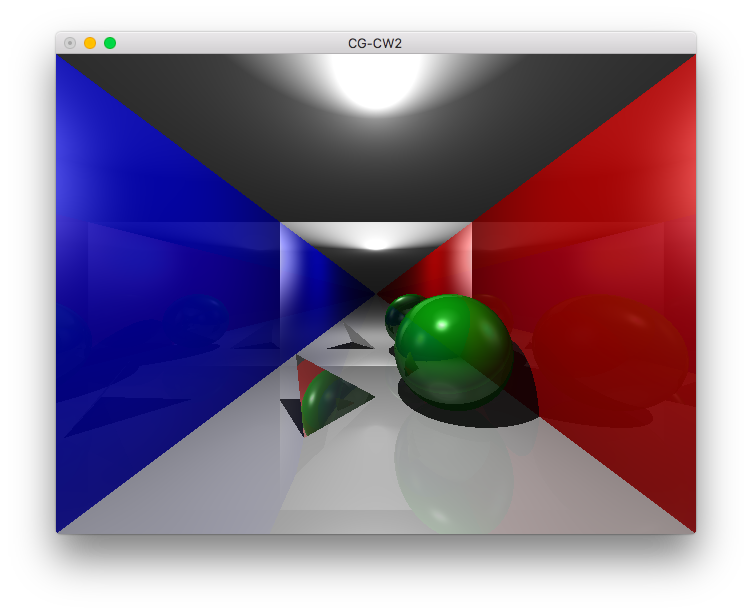
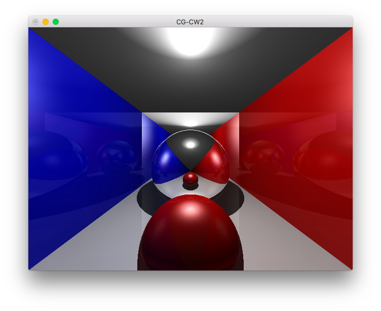
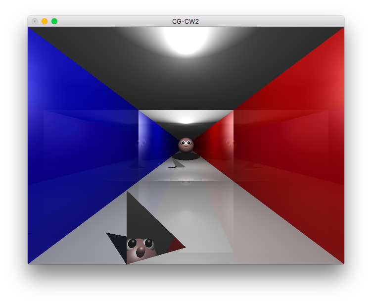
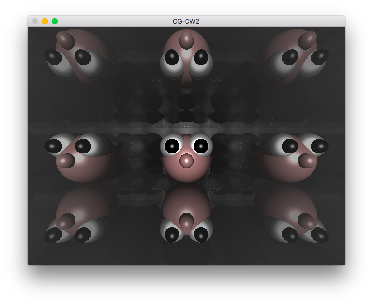
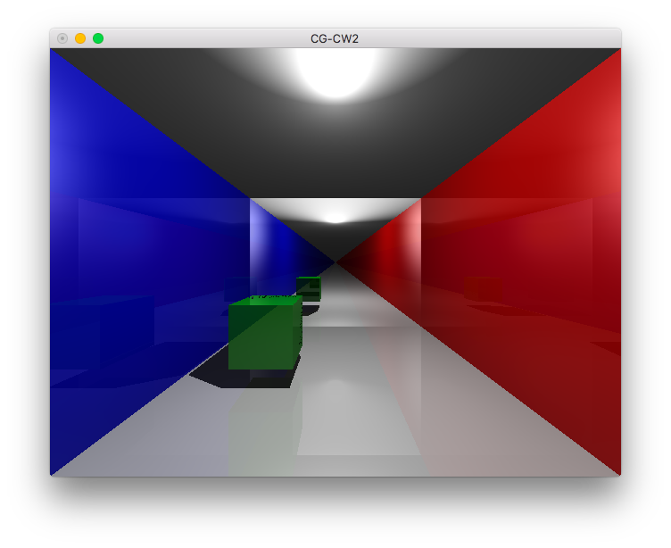

# C and Open-GL Ray Tracing Implementation

The University of Edinburgh

**Originally Coursework** : Computer Graphics

**Author** : Gavin Waite

Winter 2016

**Grade received**: A 

Confirmed to be working on macOS as of 2020-01-15

# Description

This project was the second coursework for the Computer Graphics class in my 4th year at The University of Edinburgh. The original requirements and brief are found at `Documentation/CW2_readme.pdf`.

The task was to implement, using C++, an OpenGL raytracing algorithm with shadows, Phong illumination and reflections. Scenes could then be produced by defining 3D shapes and their material properties.

I produced 5 scenes for examples and screenshots of this output is given in the below README.

# README
1 - How to compile

2 - Features

3 - Control panel and parameters of interest

4 - Screenshots (in Documentation/Screenshots)

5 - Log of implementation

## 1. How to compile:

***IMPORTANT*** : First go to the makefile and select the correct value of libs depending on your platform. Tested on macOS and the university Linux machines.
In root directory of project

> make run

You should see the first example scene of a green ball, triangular mirror and colored walls.

See # 3 for details on how to change the scene

## 2. Features

- OpenGL RayCasting implementation
- Supported object primitives: Sphere, Plane, Triangle
- Colour and Illumination: Occlusion-based shadows, specular reflections, local Phong illumination

Additional features
- Extra primitive: Axis-aligned bounding box

## 3. Control panel and parameters of interest

In the file `demo.cpp` at line 304+ there is a section called `CONTROL PANEL`.
This is where the various render parameters and options can easily be tweaked.

`lightPos` - a `vec3` which sets the position of the point light source

`activateShadows` - determines whether to display the shadows. If Phong is disabled then these are pure black, else they are the ambient colour of the material

`activatePhong` - turns on local Phong illumination calculations

`activateReflections` - turns on reflections

`maxReflections` - determines the maximum number of bounces that a reflection ray can do

`scene` - this selects which objects to populate the scene with. Brief descriptions are given and the full code is just below.

## 4. Screenshots of implementation

In the folder /Documentation/Screenshots I have included screenshots of various stages in the implementation.

The final screenshots are shown below:

>A green shiny sphere and a grey triangular mirror in a room with a mirror at the back

> In the same room, a large shiny sphere reflects a small red sphere

> A 'face' behind the camera is reflected in the backwall mirror and a small triangular mirror

> A 'face' is in a room of mirrors so is reflected many times

> A shiny green cube is on the left side of the room

### Full list of screenshots

1. First working scene. Just block colours when an intersect is found
2. Added basic shadowRay implemnetation
3. Failed Phong illumination - light too low
4. Failed Phong illumination - specular too vast
5. Fixed the Phong parameters
6. Phong illumination and shadows, working with the new efficient intersect methods on a sphere and planes
7. Illustrates my difficulties with the triangle intersect test - odd shadows and clones
8. First scene where a triangle rendered correctly
9. A better orientation to see the working triangle
10. First working test of reflection with a mirrored sphere and plane
11. Added a slight colour tint to the spherical mirror
12. Balanced the sphere to be less reflective
13. The final scene 1 - a green shiny sphere and a grey triangular mirror in a room with a mirror at the back
14. The final scene 2 - in the same room, a large shiny sphere reflects a small red sphere
15. Test of reflections to objects hidden behind camera origin
16. The final scene 3 - A 'face' behind the camera is reflected in the backwall mirror and a small triangular mirror
17. The final scene 4 - A 'face' is in a room of mirrors so is reflected many times
18. The final scene 5 - A shiny green cube is on the left side of the room

## 5. Log of implementation

1. Changed the makefile to 'Demo2' instead of 'Demo1' which was preventing it from compiling
2. Extended Object for Sphere and Plane
3. Coded the intersection texts for them (large for loop incrementing t and 'moving' the ray)
4. Added 4 planes and a sphere to the scene. Each with a different 'ambient' attribute in their Material
5. Room was rendered with block colours and no lighting
6. Added a point lightsource on the centre of the ceiling
7. After a successful intersection I then cast a new shadowRay towards the lightSource.
	- if this collided with anything (at a distance closer than the light itself) then it is occluded so is painted black
	- else I blackened the colour to simulate attenuation from distance from the light source [fig.2]
8. Did some further reading and decided to completely rework my intersect methods for Sphere and Plane
	- The loop had 2000 iterations which was the root of the very slow (5 mins) frame draw time
	- Instead use vector mathematics as shown in the 'scratchapixel' walkthrough
	- This made the scene render much faster (few seconds), although some tinkering was required to get it all working again
9. Started fixing shadowRay which is now broken from the new intersect tests
10. Now both Phong and shadows are working. The parameters may need finer tuning later
11. Extended Object for Triangle and wrote an intersection test
12. Struggling to get the triangles to draw correctly. The double-sided nature of them is difficult
13. Fixed the triangle intersect algorithm
14. Added reflectivity paramater to Material
15. Added code to generate reflected rays and have the payload sum the colour appropriately
16. Created 4 demonstration scenes

17. As an additional feature, I added a new shape - the AxisAligned box
	- It works but there is some black artifacts near the edges of the box which I was unable to find the source of
	- I created an additional scene 5 with a shiny green box

